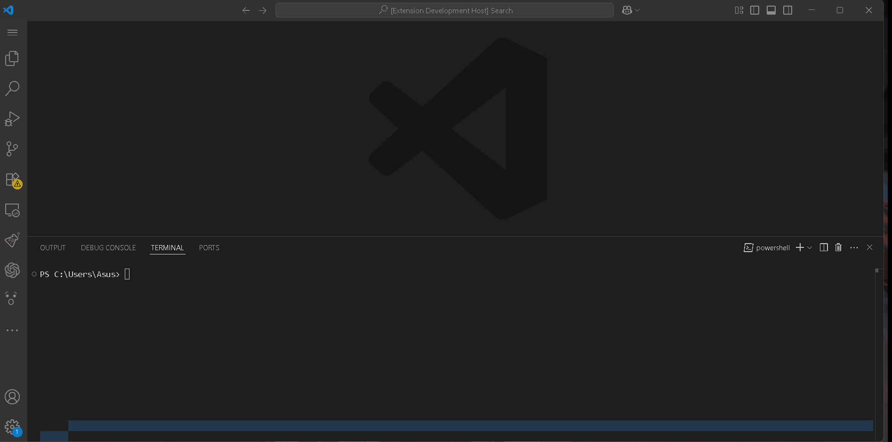

# Go Package Installer

**Install Go packages quickly — search, select version, and install without leaving VS Code!**

---

## 🚀 Features

- 🔍 Search Go packages directly from the command palette
- ⭐ Displays GitHub star count for ranking results
- 🧩 Choose version tags and run `go get` or `go install` with one click

---

## 📦 Demo

 ---

1. Run **Go Package Install** via `Ctrl+Shift+P` (or ⌘+Shift+P on macOS)
2. Enter a search keyword (e.g., `mux`)
3. Select from the ranked list of GitHub-based results
4. Choose a version tag you’d like
5. The extension executes `go get <package>@<version>` in the integrated terminal

